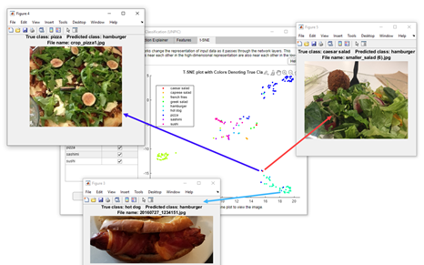
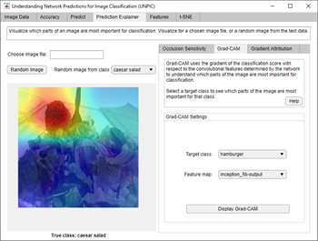
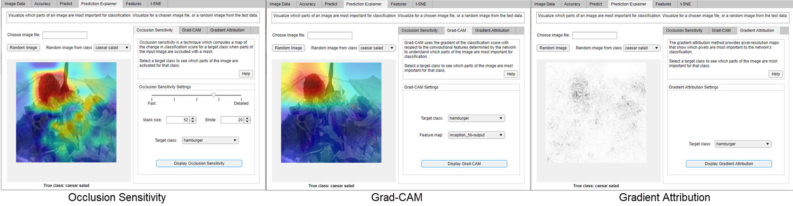
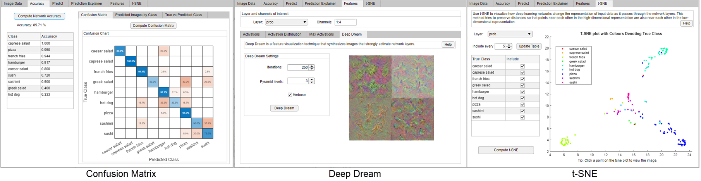

# Explore Deep Network Explainability Using an App
This repository creates an app for understanding network predictions for image classification (UNPIC). 

UNPIC is an app which can be used to explore the predictions of an image classification network using several deep learning visualization techniques. Using the app, you can:
- Calculate network accuracy and the prediction scores of an image.
- Investigate network predictions and misclassifications with occlusion sensitivity, Grad-CAM, and gradient attribution.
- Visualize activations, maximally activating images, and deep dream. 
- Compute and examine the t-SNE plot to better understand network misclassifications.



* [📦 Requirements](#requirements)   

* [🐆 Quick Start](#quick-start)

* [📂 Open the App](#open-app)

* [🚂 Open App with Own Trained Network](#open-app-with-own-trained-network)

* [🤓 Explainers](#explainers)

* [📚 References](#references)

## Requirements
- [X]  [MATLAB 2020a ](https://www.mathworks.com/products/matlab.html) or later
- [X]  [Deep Learning Toolbox](https://www.mathworks.com/products/deep-learning.html)
- [ ]  [Statistics and Machine Learning Toolbox](https://www.mathworks.com/products/statistics.html) (only required for t-SNE)
- [ ]  [Parallel Computing Toolbox](https://www.mathworks.com/products/parallel-computing.html) (only required for training using a GPU)


## Quick Start
Download or clone the repository and then run the script `startUNPIC.mlx` to open the app with a trained image classification network.

## Open App
UNPIC is an app for interactively comparing different deep learning visualization techniques. The easiest way to get started with UNPIC is to download the repository and then open and run a live script example.  
* Click **Run** on the `ExploreTrainedFoodClassificationNetwork.mlx` live script to open the app with a pretrained network and image datastore.
   <details> 
   <summary>Example Steps</summary>

   1. Import image data and trained network
   2. Explore the trained network using several visualization techniques in an app
   </details>

* Click **Run** on the `VisualizeTrainedNetworkExample.mlx` live script to build and train a network and then open the app.
  <details> 
  <summary>Example Steps</summary>

   1. Import image data and create a datastore object                                     
   2. Prepare a pretrained network for transfer learning                           
   3. Train a food image classification network                                    
   4. Explore the trained network using several visualization techniques in an app
   </details>

* Open the app with your own trained network `net` and image datastore `imds` using `UNPIC(net,imds)`. For more information, see [Open App with Own Trained Network](#open-app-with-own-trained-network).

The UNPIC app is attached as a supporting file (`UNPIC.mlapp`) and includes several visualisation techniques to help you explain what a network has learned. Once you have the app open, click **Help** to learn more about the techniques and methods implemented. 

UNPIC is created using App Designer. You can use App Designer to edit the underlying settings of the methods or add additional methods to the app.

## Open App with Own Trained Network
To use the app, you must have a trained network and an image datastore. The network must be trained on images with the same class labels as the image datastore object. See the example live scripts to see how to prepare an `imageDatastore` object and train a network. Using the image data you can explore what the trained network has learned. Suppose you have a trained network called `net` and a validation image datastore called `imdsVal`, you can easily open the app to explore the trained network. 
```
UNPIC(net,imdsVal);
``` 

This app is created for use with a DAG or series image classification network, trained on RGB or grayscale images stored in an image datastore object. To use many of the visualization methods, your network must also have a `softmaxLayer`.

You are advised to run the live scripts to get a feel for how the app works before exploring your own trained network. For more advanced use cases, such as large data, large number of classes, or nonimage data, you will need to adapt the code using App Designer. For more information on using App Designer to create apps interactively, see [Develop Apps Using App Designer](https://www.mathworks.com/help/matlab/app-designer.html).


## Explainers
The app illustrates several explanation techniques.
##### Occlusion Sensitivity 
Occlusion sensitivity is a simple technique for understanding which parts of an image are most important for a deep network's classification [[1]](#references). You can measure a network's sensitivity to occlusion in different regions of the data using small perturbations of the data. For more information, see [Understand Network Predictions Using Occlusion](https://www.mathworks.com/help/deeplearning/ug/understand-network-predictions-using-occlusion.html).
##### Grad-CAM
Grad-CAM, invented by Selvaraju and coauthors [[2]](#references), uses the gradient of the classification score with respect to the convolutional features determined by the network in order to understand which parts of the image are most important for classification. For more information, see [Grad-CAM Reveals the Why Behind Deep Learning Decisions](https://www.mathworks.com/help/deeplearning/ug/gradcam-explains-why.html).
##### Gradient Attribution  
Gradient attribution provides pixel-resolution maps that show which pixels are most important to the network's classification [[3]](#references). Intuitively, the map shows which pixels most affect the class score when changed. For more information, see [Investigate Classification Decisions Using Gradient Attribution Techniques](https://www.mathworks.com/help/deeplearning/ug/investigate-classification-decisions-using-gradient-attribution-techniques.html).



##### Confusion Matrix
The confusion matrix plot displays the predicted class vs the true class. Use this to see which classes the network struggles the most with.

##### Deep Dream 
Deep Dream is a feature visualization technique in deep learning that synthesizes images that strongly activate network layers [[4]](#references). By visualizing these images, you can highlight the image features learned by a network. These images are useful for understanding and diagnosing network behaviour. For more information, see [Deep Dream Images Using GoogLeNet](https://www.mathworks.com/help/deeplearning/ug/deep-dream-images-using-googlenet.html).
##### t-SNE
Use t-SNE to visualize the network activations and gain an understanding of how the network responds [[5]](#references). You can use t-SNE to visualize how deep learning networks change the representation of input data as it passes through the network layers.  t-SNE is good for reducing high-dimensional activations into an easy-to-use 2-D “map” of the data. For more information, see [View Network Behaviour Using tsne](https://www.mathworks.com/help/deeplearning/ug/view-network-behavior-using-tsne.html).




## References
[1] Zeiler M.D., Fergus R. (2014) Visualizing and Understanding Convolutional Networks. In: Fleet D., Pajdla T., Schiele B., Tuytelaars T. (eds) Computer Vision – ECCV 2014. ECCV 2014. Lecture Notes in Computer Science, vol 8689. Springer, Cham   

[2] Selvaraju, R. R., M. Cogswell, A. Das, R. Vedantam, D. Parikh, and D. Batra. "Grad-CAM: Visual Explanations from Deep Networks via Gradient-Based Localization." In IEEE International Conference on Computer Vision (ICCV), 2017, pp. 618–626. Available at Grad-CAM on the Computer Vision Foundation Open Access website.   

[3] Simonyan, Karen, Andrea Vedaldi, and Andrew Zisserman. “Deep Inside Convolutional Networks: Visualising Image Classification Models and Saliency Maps.” ArXiv:1312.6034 [Cs], April 19, 2014. http://arxiv.org/abs/1312.6034.   

[4] DeepDreaming with TensorFlow. https://github.com/tensorflow/docs/blob/master/site/en/tutorials/generative/deepdream.ipynb   

[5] van der Maaten, Laurens, and Geoffrey Hinton. "Visualizing Data using t-SNE." Journal of Machine Learning Research 9, 2008, pp. 2579–2605.   

*Copyright 2020 The MathWorks, Inc.*
